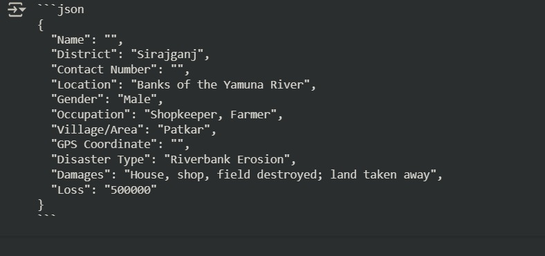
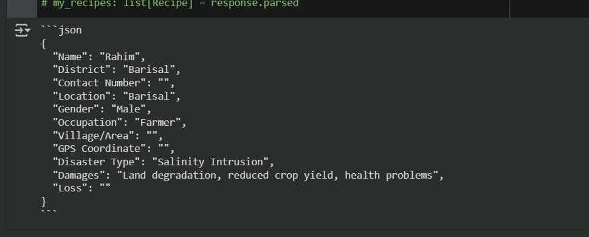

# 🎤 Audio Reporting System  
## Turning Phone Calls into Calamity Reports — Automatically

---

## 💡 Overview

This system helps turn **crisis reports made over the phone** into **PDF documents** that are ready for use by emergency response teams.

- No smartphone, app, or internet needed
- Built to **work at scale**, handle many calls at once
- Adds structure and clarity to voice reports
- **Learns over time** using fine tuning pipeline.
- Designed to **assist human teams**.

---

## 🔄 End-to-End Workflow

### 1. 📞 Call Recorded  
A person affected by a disaster makes a phone call. The system automatically records and stores the call.

> ✅ No manual intervention needed

---

### 2. 🗣️ Speech-to-Text Conversion  
The system listens to the audio and **translates the voice into text** using advanced voice recognition.

> Example: “আনুমানিক হচ্ছে আপনার ৫০ হাজার টাকা মতো লস” becomes readable text.
> With time and data trancription can be better even for regional languages.
---

### 3. 🧠 Smart Data Extraction  
AI reads the transcribed text and **pulls out key facts**:
- What happened?
- Where did it happen?
- How serious is it?
- What resources might be needed?

Two types of AI models work here:
- One understands structured information (like forms)
- Another handles free-flowing speech (like conversations)

---

### 4. 📄 PDF Report Creation  
A structured report is generated automatically:
- Includes details from the call
- Adds relevant online information (e.g., location maps, weather data)
- Exported as a clean, shareable PDF

---

### 5. 👀 Optional Human Validation  
Before the report is finalized, a **human validator can check**:
- Does the report match the audio?
- Are all facts correct?
- Is anything missing?

This ensures **accountability and accuracy** when it matters most.

---

## ⚙️ Behind the Scenes (Simplified)

- **Task Manager**: Makes sure each call is processed in order
- **Message Queues**: Keeps things moving even under heavy load
- **Cloud Storage**: Keeps reports safe and accessible
- **Fine-Tuning Engine**: Learns from feedback to improve AI over time

---

## 🌍 Real-World Benefits

### 🚀 Fast Response  
- Cuts hours of manual transcription and writing  
- Teams can act on verified reports almost instantly

### 🏕️ Reaches Remote Areas  
- Works with any phone that can make a call  
- Designed for regions with limited internet or infrastructure

### 📈 Scales with Demand  
- Can handle dozens (or hundreds) of reports a day  
- Ready for both everyday needs and large-scale emergencies

### ❤️ Built to Support Human Efforts  
- Frees up staff time  
- Ensures quality through human validation  
- Amplifies local voices and community reports

---

## 🧾 Final Output: Actionable Reports

Each call becomes a:
- 📄 Professionally formatted PDF  
- 🌐 Enriched with external info  
- 📂 Stored securely for access by aid teams and decision-makers

---

## ✅ Summary

This system transforms human voice into **structured, reliable information** —  
All through automation, without losing the **human touch**.

- Built for speed, scale, and trust  
- Combines AI power with human oversight  
- Helps NGOs **respond smarter and faster**

